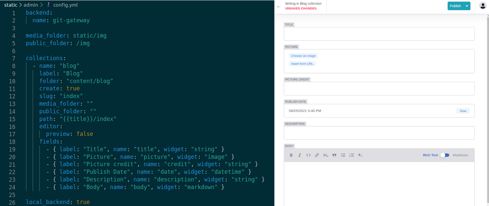
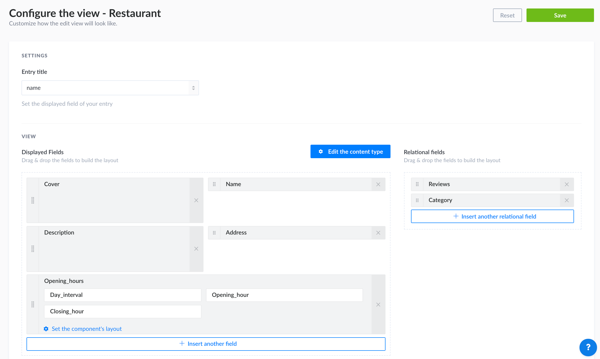

## What The Jamstack?

If you are reading this, there's a good chance you've already heard about the "Jamstack" buzzword. However, fast paced changes (and a considerable amount of hype) made it overwhelming to determine what does it even mean and, therefore, which technologies you could use for your specific needs. After all, **Jamstack itself isn't a concrete implementation but an architectonic philosophy behind web development.**

I won't go deep into it, as it's beyond the scope of this post, but you can use [Jamstack's official site](https://jamstack.org/) as a good learning source.

## **Decoupling data sources**

There are lots of clever ideas coming from the Jamstack world but, in my humble opinion, data handling is probably the most promising part of it. You can go ahead and pick **whatever-cutting-edge-frontend-library-you-like** and your **client's existing CMS** and maintain them independently (therefore being heterogeneus by definition).

This sounds pretty basic for any fullstack developer that's keen on client-server architectures, but for **99.99% of projects that involved simple content management** (e.g. e-commerce catalogs, blogs, landing pages), being too fancy wasn't worth it and everyone would just settle for plugin-bloated PHP-based CMS platforms 

*\*shows 30%-of-websites-are-powered-by-wordpress-piechart* *and reader proceeds to eyeroll*

Of course this always made sense: **content authors (tipically) don't care about subjacent implementations**. However, Jamstack is closing the gap by giving you the best of both worlds: familiar content management for site owners, and modern technology stacks for picky developers.

## Making decisions

Well, you'll likely end up asking yourself: *now that I have options*, *what should I use?*

The silver-bullet answer is, as always, *it depends*. Self hosting a powerful CMS for simple blog posts (like the one you are reading right now) feels like an overkill. On the other hand, storing e-commerce products as markdown files in source control seems tedious. **It all depends on how dynamic your content will be** (this is, how likely it will change). Of course there are other factors, such as **working for a client that's already loaded their content somewhere,** or **needing specific features** for some reason.

I've come up with a simple overview of the most common options that are out here, grouped by their nature. If you need an exhaustive list, feel free to go *[here](https://jamstack.org/headless-cms/).*

### Git vs. API based

* **git based:** this type of CMS's are the go-to option **when your content can simply live in source control**, tipically stored as **markdown files** that are easy to consume at build time and inject into your generated pages. \
  \
  You can simply think of these as **fancy editors for your files**: you write rich text and, once you publish, it get's saved as markdown in the filesystem. Some of them also allow you to **sync with your upstream repository** and create new commits whenever you publish, therefore triggering a build and regenerating your site with new / updated content.\
  \
  My favorite one (that's also being used in this blog) is [NetlifyCMS](https://www.netlifycms.org/), as it integrates seamlessly with your netlify site's panel and also allows you to fire up a local proxy for offline development.

<figure>
  
  <figcaption>NetlifyCMS turns your content's shape into fancy UI widgets</figcaption>
</figure>

* **API based:** as its name indicates, these CMS's expose content via an API, tipically using JSON or GraphQL. You can consume them **both at build and runtime**, and they require minimal client configuration (pointing to the endpoint URL inside the frontend's config or setting token based auth). \
  \
  Even though they expose more powerful features, they also tend to be either **self-hosted** (i.e. you should host it yourself on the cloud) or **pricy SaaS** (although this depends on the amount of users / features you need).\
  \
  Good examples are the headless versions of **Wordpress**, **Shopify**, and the modern **[Strapi](https://strapi.io/)**.

<figure>
  
  <figcaption>Strapi's power in action - screenshot taken from the <a href="https://strapi.io/documentation/user-docs/latest/content-manager/configuring-view-of-content-type.html#configuring-the-edit-view">official docs</a></figcaption>
</figure>

## Being realistic

If you are (or about to become) a Jamstack developer, chances are you will have to **learn several CMS platforms on the fly**. IMHO it doesn't make sense trying to understand all of them deeply beforehand and, like programming in general, it's more important to understand the underlying principles and then adapt to certain use cases.

You can also pick whichever you like the most (for whatever reason) and feel comfortable landing specific jobs.

## TL;DR

**Jamstack is growing faster everyday and we are yet to find upcoming standards**! Go ahead and tinker with  your favorite frameworks and enjoy being part of [the way of the future](https://www.youtube.com/watch?v=4_Pbx9mvWPY).